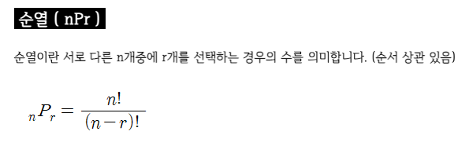

# Itertools1

> [공식 링크](https://python.flowdas.com/library/itertools.html)

> 효율적인 루핑을 위한 `이터레이터`를 만드는 함수. 반복에 대한 로직을 좀 더 쉽게 구현하기 위해서 파이썬에서 제공해주는 모듈

```
이터레이터(iterator : 반복자)란?
여러 개의 요소를 가지는 컨테이너(리스트,튜플,딕셔너리, 문자열 등)에서 각 요소를 하나씩 꺼내 어떤 처리를 수행하는 간편한 방법을 제공하는 객체
```

<br />

## 곱집합

> itertools.product()

```
INPUT  : ABCD XY
OUTPUT : AX AY BX BY CX CY DX DY
```

### general solution

```python
result = []
string1 = 'ABCD'
string2 = 'XY'
for i in string1:
    for j in string2:
        result.append(i + j)

print(result) # ['AX', 'AY', 'BX', 'BY', 'CX', 'CY', 'DX', 'DY']
```

### pythonic solution

```python
import itertools

string1 = 'ABCD'
string2 = 'XY'

itertools.product(string1, string2)
new_list = list(map(''.join, itertools.product(string1, string2)))

print(new_list) # ['AX', 'AY', 'BX', 'BY', 'CX', 'CY', 'DX', 'DY']
```

> 일반적인 풀이는 이중 for문을 사용하였다. 여기서는 문자열(iterable 객체는 모두 가능)이 2개지만 더 많아지면 많아지는 만큼 for문도 늘어나게 된다. 하지만 파이써닉한 풀이처럼 itertools의 product() 메소드를 이용하면 문자열의 개수에 상관없이 한 줄이면 모두 표현할 수 있게 된다. 와우~ 굉장히 간단 명료한 코드를 볼 수 있다. 😎

<br />

```python
import itertools

string3 = 'asdf'
iter_list = list(itertools.product(string3, repeat=3))
print(iter_list)
```

> 위의 결과를 예상할 수 있겠는가? 🤔

> 위의 코드는 'asdf' 자기 자신을 3번 반복한 것이다. 즉 `'asdf', 'asdf', 'asdf'`의 문자열 3개에서 각각 한개씩 고른 모든 경우의 수이다. `4 * 4 * 4`와 같은 경우의 수이다.

```python
[('a', 'a', 'a'), ('a', 'a', 's'), ('a', 'a', 'd'), ('a', 'a', 'f'), ('a', 's', 'a'), ('a', 's', 's'), ('a', 's', 'd'),
 ('a', 's', 'f'), ('a', 'd', 'a'), ('a', 'd', 's'), ('a', 'd', 'd'), ('a', 'd', 'f'), ('a', 'f', 'a'), ('a', 'f', 's'),
 ('a', 'f', 'd'), ('a', 'f', 'f'), ('s', 'a', 'a'), ('s', 'a', 's'), ('s', 'a', 'd'), ('s', 'a', 'f'), ('s', 's', 'a'),
 ('s', 's', 's'), ('s', 's', 'd'), ('s', 's', 'f'), ('s', 'd', 'a'), ('s', 'd', 's'), ('s', 'd', 'd'), ('s', 'd', 'f'),
 ('s', 'f', 'a'), ('s', 'f', 's'), ('s', 'f', 'd'), ('s', 'f', 'f'), ('d', 'a', 'a'), ('d', 'a', 's'), ('d', 'a', 'd'),
 ('d', 'a', 'f'), ('d', 's', 'a'), ('d', 's', 's'), ('d', 's', 'd'), ('d', 's', 'f'), ('d', 'd', 'a'), ('d', 'd', 's'),
 ('d', 'd', 'd'), ('d', 'd', 'f'), ('d', 'f', 'a'), ('d', 'f', 's'), ('d', 'f', 'd'), ('d', 'f', 'f'), ('f', 'a', 'a'),
 ('f', 'a', 's'), ('f', 'a', 'd'), ('f', 'a', 'f'), ('f', 's', 'a'), ('f', 's', 's'), ('f', 's', 'd'), ('f', 's', 'f'),
 ('f', 'd', 'a'), ('f', 'd', 's'), ('f', 'd', 'd'), ('f', 'd', 'f'), ('f', 'f', 'a'), ('f', 'f', 's'), ('f', 'f', 'd'),
 ('f', 'f', 'f')]
```

> 64가지의 결과값이다.

파이썬을 배우고 있는 파린이 입장에서 왜 이런 값을 구해야할까? 이거 어디에 활용할 수 있지라는 생각이 들었다. 간단히 생각해보면 우리가 무엇인가를 구현할 때 리스트 간의 모든 경우의 수를 구해야 하는 경우 보통 반복문을 통해서 경우를 따진다. 이런 경우 이 메소드를 사용하면 간단하게 모든 경우를 담은 리스트를 얻을 수 있고 거기서 2차 가공물을 만들 수 있을 것이다. 참고로 이러한 경우의 수를 구하는 것을 [데카르트의 곱](https://ko.wikipedia.org/wiki/%EA%B3%B1%EC%A7%91%ED%95%A9)이라고 한다.

<br />

## 순열

> itertools.permutations()



위의 식을 어떻게 구현할 수 있을까? 생각을 하다보면 머리가 아파온다. 파이썬은 나의 이러한 고통을 아는 것인지 `permutations()`라는 좋은 메소드를 만들어 놓았다. 이제 이것을 <u>어떻게 사용하는지를 알고 순열을 사용해야하는 상황</u>에서 정확하게 가져와 사용하면 될 것이다.

```python
import itertools
# itertools.permutations(iterable, r=len(iterable))

string1 = 'ABCD'

itertools.permutations(string1, 2)
# AB AC AD BA BC BD CA CB CD DA DB DC
```

> r의 기본값은 iterable의 길이이다. 만약에 r이 없다면 길이만큼 최대 길이의 순열이 생성된다. 실제 결과값은 <u>순열 튜플</u>이 정렬된 형태로 나타나게 된다. `('A', 'B') .... ('D', 'C')`

<br />

## 조합

> itertools.combinations()


조합 역시 순열과 마찬가지이다. 조합 연산을 쉽게할 수 있도록 만들어진 메소드이다.

```python
import itertools
# itertools.combinations(iterable, r)
string1 = 'ABCD'

itertools.combinations(string1, 2)
# AB AC AD BC BD CD
```

> 순열과 다르게 r의 값이 필수값이며, r은 iterable의 요소 중에서 몇 개를 고를 것인가에 해당하는 값을 말한다. 실제 결과값은 <u>조합 튜플</u>이 정렬된 형태로 나타나게 된다. `('A', 'B') .... ('C', 'D')`

<br />

**참고1**

위에서 언급한 3가지 메소드 외에도 많은 메소드가 `itertools`안에 들어있다. 직접 문서를 찾아보는 것을 추천한다. 아마 자신에게 유용한 많은 메소드를 손에 넣을 수 있을 것이다.

**참고2**

순열과 조합은 알고리즘 테스트에서 로직 중간에 필요한 경우가 생길 수 있다. 그래서 위의 메소드를 사용하려는 시도를 할 수 있다. 하지만 (안타깝게도) 일반적으로 알고리즘 테스트에서는 `itertools`라는 모듈을 사용할 수 없다. 그렇기 때문에 이러한 로직을 구현하여 풀이를 하는 것이 테스트의 목적이 될 수 있다는 점 알아두고 실제로 순열과 조합을 파이썬으로 구현해보도록 하자.

**참고3**

product()와 permutations()/combinations()와의 차이점은 무엇일까? 처음엔 `product()와 permutations()은 결과값이 비슷한 경우가 생길 수 있다` 라는 생각을 했다. 하지만 그것은 착각이였다. 가장 큰 차이점은 permutations()은 **하나의 iterable**에서의 순서에 따른 경우의 수를 나타낸다. 반면에 product()는 **두 개 이상의 iterable**에서의 모든 경우의 수를 나타낸다. combinations() 역시 permutations()과 마찬가지이다.

> 수학적으로 이야기하면 product()는 `중복순열`을 말한다. 하지만 중요한 것은 위에서 말한 것처럼 <u>가장 큰 차이점은 사용되는 상황이 다르다는 것</u>을 알아두자.
