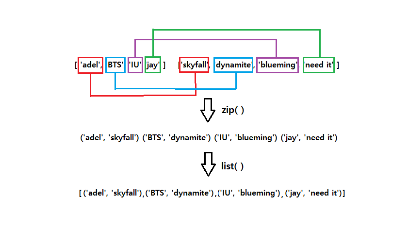

# 문제5

## 문제

 > 이차원 리스트 뒤집기

solution 함수는 이차원 리스트, mylist를 인자로 받는다.
solution 함수는 mylist 원소의 행과 열을 뒤집은 한 값을 리턴해야한다.

### 출력 예시
> INPUT

```python
[
    [1, 2, 3],
    [4 ,5, 6],
    [7, 8, 9]
]
```

> OUPUT

```python
[
    [1, 4, 7],
    [2, 5, 8],
    [3, 6, 9]
]
```

`제한 조건`

- mylist의 원소의 길이는 모두 같습니다.
- mylist의 길이는 mylist[0]의 길이와 같습니다.
- 각 리스트의 길이는 100 이하인 자연수입니다.

## my solution

```python
def solution(mylist):
    length = len(mylist)
    newlist = []
    for i in range(length):
        newlist.append([])
        for j in range(length):
            newlist[i].append(mylist[j][i])
    return newlist
```

> 일반적으로 푸는 방법이다. `명령적인` 풀이 방식이다.

## pythonic solution

```python
def solution(mylist):
    newlist = list(map(list, zip(*mylist)))
    return newlist
```

> 와우 🤩 이렇게도 풀 수 있다니... 안타까운 것은 여기에 나온 메소드를 처음본게 아니라는 것이다. 이제 이 코드에 대해서 알아보자.

### zip()

zip()은 동일한 개수의 이터러블 객체를 모아서 튜플의 형태로 반환한다. 개념적으로 설명하면 좀 더 깊이 있는(?) 용어를 사용하는 것 같아서 우선적으로 메소드가 어떤 결과를 보여주는지에 초점을 맞추고 알아보았다.

```python
singers = ['adel', 'BTS', 'IU', 'jay']
songs = ['skyfall', 'dynamite','blueming', 'need it']
list(zip(singers , songs))
```

위의 코드를 도식화하면 아래 이미지와 같다.



각각의 리스트에서 같은색의 상자끼리(리스트의 같은 순서에 있는 것끼리) 모아서 하나의 튜플이 만들어진다. 그렇게 리스트의 길이 만큼의 튜플이 만들어진다. 이것이 zip()에 의해서 만들어진 결과이다. 참고로 zip을 지퍼라고 생각하고 두 개를 서로 엮는다고 연상을 하면 기억하기 쉬울 수 있다. 물론 리스트 두 개만을 합칠 수 있는 것은 아니다. 같은 길이의 리스트라면 여러 개도 가능하다.

그런데 만약 같은 길이가 아니라면?? 궁금해서 실험해봤다.

```python
list1 = [1, 2, 3]
list2 = [11, 22, 33]
list3 = [111, 222]

list(zip(list1, list2, list3)) # 어떤 결과가 나올까?
```

결과는 `[(1, 11, 111), (2, 22, 222)]` 이렇다. 같은 길이로 만들수 있는 곳까지만 만들어진다. 즉 리스트가 3개면 합쳐서 3의 길이를 갖는 튜플이 만들어질 수 있는 곳까지만 진행이 된다.

<br/>

> 참고로 zip()을 통해서 딕셔너리를 생성할 수 있다.

```python
singers = ['adel', 'BTS', 'IU', 'jay']
songs = ['skyfall', 'dynamite','blueming', 'need it']
dict(zip(singers , songs))
# {'adel': 'skyfall', 'BTS': 'dynamite', 'IU': 'blueming', 'jay': 'need it'}
```

<br/>

### \*

앞에서 *에 대해서 배웠다. [문제 2번 정리](pb2.md)에서 공부했듯이 *에는 4가지 기능이 있다. 그 중 여기서는 컨테이너 타입의 데이터를 Unpacking 하는 경우에 해당한다. 마치 자바스크립트의 `spread operator` 처럼 말이다. 이 때문에 주어진 2차 리스트가 벗겨져서(?) zip() 안으로 3개의 리스트가 인자로 들어갈 수 있다.

<br/>

### map()

map() 역시 앞에서 배웠다. map()에는 두 개의 인자를 받을 수 있다. 첫번째 인자는 메서드이고, 두번째 인자는 이터러블한 객체이다. 두번째 인자의 각각에 첫번째 인자의 메서드를 실행한다. 즉 zip()을 통해서 나온 결과값은 각각이 튜플이기 때문에 이를 list()로 연산하여 리스트화 시켜준다. 그 후 전체에 다시 list() 해주면 2차 리스트가 만들어진다.
