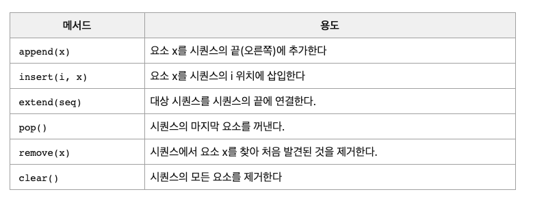

# 시퀀스(Sequence)

> 파이썬의 시퀀스에 대해서 정리한 문서

> [참고문서](https://python.bakyeono.net/chapter-5-2.html)

- Sequece는 순서라는 의미로서 <u>파이썬의 가장 기본적인 데이터 구조</u>를 나타낸다.

- 데이터를 순서대로 하나씩 나열 순서를 붙여서 나열한 것을 말한다.

- 특정위치(인덱스)를 통해서 데이터에 접근할 수 있다.

- 시퀀스의 종류 : 리스트(list), 튜플(tuple), 레인지(range), 문자열(string), bytes, bytearray

## 리스트

```python
numbers = [1, 2, 3, 4]
movie_list = ['batman begins', 'interstellar', 'big short']
```

> 네이밍 방법으로는 주로 해당 요소의 복수형이나 끝에 시퀀스 타입을 접미사로 붙여준다.

### 포함여부

```python
3 in numbers # True
'about time' in movie_list # False
```

### 길이

```python
len(numbers) # 4
len(movie_list) # 3
```

### 반복

```python
 numbers * 3
 # [1, 2, 3, 4, 1, 2, 3, 4, 1, 2, 3, 4]
```

### 연결

```python
numbers + movie_list
# [1, 2, 3, 4, 'batman begins', 'interstellar', 'big short']
```

### 인덱싱

```python
numbers[2] # 3
movie_list[-1] # big short
numbers[3] = 10 # numbers = [1, 2, 3, 10]

movie_list[5]
# IndexError: list index out of range
```

> index를 통해서 시퀀스 요소(여기선 리스트 요소)에 접근할 수 있다. 0부터 시작하고 -1로 끝을 인덱싱할 수 있다.

> 없는 요소에 접근하려고 하면 에러가 발생한다.

### 슬라이싱

- 슬라이싱은 인덱싱과 다르게 범위를 선택하여 새로운 리스트를 만들 수 있다.

- [start:stop:step] : start(시작인덱스) <= [ ] < stop(끝인덱스) / step : 요소 사이의 거리와 방향을 설정

- start와 stop의 기본값은 양끝 값을 갖는다. step이 양수이면 왼쪽부터, 음수이면 오른쪽부터 시작한다.

  ```python
  number_list = [1, 2, 3, 4, 5, 6, 7, 8, 9, 10]
  coins = ['bitcoin', 'ethereum', 'ripple', 'polkadot', 'cardano', 'XRP', 'litecoin', 'stellar', 'klayton' ]

  number_list[:] # [1, 2, 3, 4, 5, 6, 7, 8, 9, 10]
  number_list[3:7] # [4, 5, 6, 7]
  number_list[3:7:2] # [4, 6]
  number_list[::-2] # [10, 8, 6, 4, 2]
  coins[-2:-5:-1] # ['stellar', 'litecoin', 'XRP']
  coins[4:] # ['cardano', 'XRP', 'litecoin', 'stellar', 'klayton']
  coins[:8:2] # ['bitcoin', 'ripple', 'cardano', 'litecoin']
  ```

### 복제

> 이 부분은 `깊은 복사와 얕은 복사`와 관련된 부분이다. 좀 더 깊이 있게 찾아보는 것을 추천한다.

- 위에서 말한 것처럼 슬라이싱을 통해서 만들어진 리스트는 새로운 리스트이다. 그렇기 때문에 원본과는 내용만 같은 리스트가 된다. 즉, <u>원본과 복사본은 독립적인 리스트</u>가 된다. 그래서 요소를 수정, 변형시키면 서로에게 영향을 미치지 않는다.

  ```python
  copy_numbers = number_list[:]
  number_list == copy_numbers # True : 내용 동일
  copy_numbers[5] = 60
  copy_numbers[6:10] = [70, 80, 90, 100]
  print(copy_numbers)
  # [1, 2, 3, 4, 5, 60, 70, 80, 90, 100]
  print(number_list)
  # [1, 2, 3, 4, 5, 6, 7, 8, 9, 10]
  ```

- 아래와 같이 리스트를 다른 변수에 대입(할당)하게 되면 둘은 내용뿐만 아니라 <u>완전 같은 리스트</u>가 된다. 그래서 두 리스트 중에서 하나만 변경하여도 양쪽에 모두 영향을 미치기 된다.(모두 변경된다)

  ```python
  clone_list = number_list
  print(clone_list) # [1, 2, 3, 4, 5, 6, 7, 8, 9, 10]
  clone_list[5] = 600
  print(clone_list)
  # [1, 2, 3, 4, 5, 600, 7, 8, 9, 10]
  print(number_list)
  # [1, 2, 3, 4, 5, 600, 7, 8, 9, 10]
  ```

### 조작 메서드

- <u>조작 메서드는 mutable sequence에만 사용이 가능하다.</u> 아래에서 설명할 튜플이나 레인지, 문자열에는 사용 불가능하고 리스트에서 주로 사용한다.

  

<br />

## 튜플

- 리스트와 거의 같다. 하지만 차이점은 한 번 담은 데이터는 바꿀 수 없다. 튜플은 정의될 때 데이터가 결정되고 그 이후에는 변경할 수 없다.(추가도 안된다.)

- 튜플에서는 리스트에서 사용했던 메소드가 모두 적용된다. 단, 튜플 요소를 변경하는 메소드는 사용할 수 없다.

  ```python
  empty_tuple = () # 빈 튜플
  one_tuple = (1, ) # 요소 1개인 경우 ,를 찍어주는 것을 추천
  days = ('월', '화', '수', '목', '금', '토', '일')
  ```

## 레인지

- 순차적인 숫자를 가진 데이터를 표현해야 하는 경우 사용하는 시퀀스 타입이다. range() 함수를 이용해서 만들 수 있다.

- range() 함수는 전달받은 인자를 바탕으로 순차적인 숫자를 가지는 리스트 타입의 객체를 반환한다. 인자는 아래와 같이 3가지 방법으로 넣을 수 있다. 각각 상황에 맞게 사용할 수 있다.

  ```python
  # 1) range(stop)
  range(5)
  # [0, 1, 2, 3, 4]

  # 2) range(start, stop)
  range(1, 5)
  # [1, 2, 3, 4]

  # 3) range(start, stop, step)
  range(1, 10, 2)
  # [1, 3, 5, 7, 9]
  range(10, 1, -2)
  # [10, 8, 6, 4, 2]
  ```

- 1번 : start의 기본값은 0이다. stop은 필수값으로서 stop 앞까지 순차적으로 1씩 증가하는 리스트를 만든다. step이 없는 경우 기본값은 1이다.

- 2번 : 1번과는 다르게 start가 1이기 때문에 1부터 시작한다.

- 3번 : step이 2이기 때문에 나열의 간격이 2가 된다. 보통 start와 step을 변경하여 원하는 숫자 배열을 만들어낼 수 있다. 위의 경우에는 홀수 리스트가 된다. 2부터 시작한다면 짝수 리스트가 될 수 있다. 참고로 step에 음수가 들어가면 순차적으로 작아지는 리스트를 만들 수도 있다.

<br />

> [참고] 레인지는 요소를 처음부터 갖고 있지 않다. 레인지 요소를 사용하는 시점에 만들어서 사용한다. 그렇기 때문에 파이썬 쉘에서 range(1, 10)을 출력하면 예상하던 결과값(숫자 리스트)와는 다르게 해당 명령문이 다시 출력된다. 그래서 list()로 타입을 변경하면 원하던 출력값을 확인할 수 있다. 이렇게 <u>요소를 갖고 있지 않기 때문에 값을 수정하는 것이 불가능하다.(불변 데이터 : immutable)</u> 단, 그 외의 시퀀스로서 사용가능한 기능(인덱싱, 슬라이싱)은 가능하다.

## 문자열

- 문자열도 시퀀스이다. 단, 해당 요소가 문자로만 한정되어 있다는 점만 다르다. 위에서 말한 시퀀스로서 사용가능한 메소드를 사용할 수 있다. 단, 불변데이터이기 때문에 요소를 수정하는 것은 불가능하다.

  ```python
  title = 'Life is short, We need Python!'
  title[10]
  title[15:] # We need Python!
  title[:13] # Life is short

  title[23] = 'Java'
  # TypeError: 'str' object does not support item assignment

  '-'.join(title.split())
  # 'Life-is-short,-We-need-Python!
  ```
